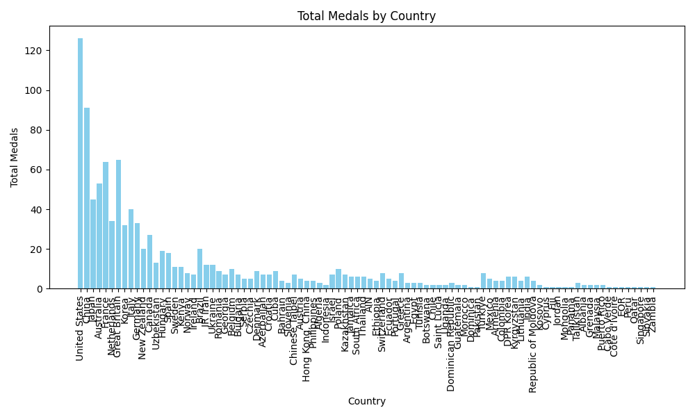

# Summary Statistics Report

## Summary Statistics for Total Medals
|       |    Total |
|:------|---------:|
| count |  92      |
| mean  |  11.337  |
| std   |  19.6106 |
| min   |   1      |
| 25%   |   2      |
| 50%   |   5      |
| 75%   |   9      |
| max   | 126      |

## Mean Total Medals: 
11.33695652173913
## Median Total Medals: 
5.0
## Standard Deviation of Total Medals: 
19.610648135790445
## Data Visualization

